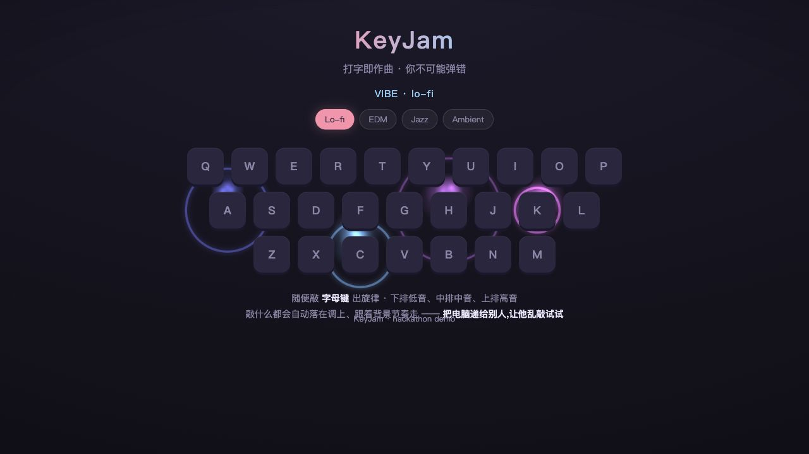
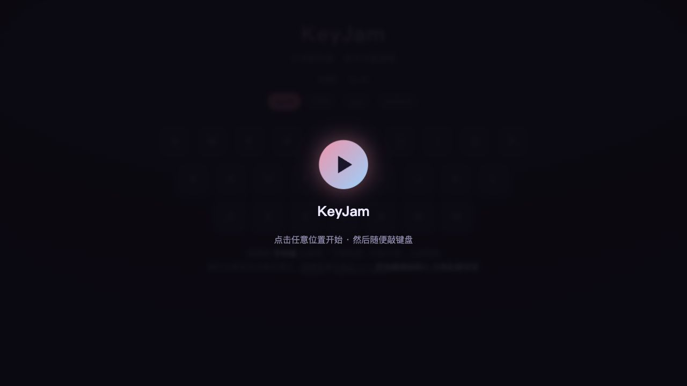

# MuseKey / KeyJam

**打字即作曲。** MuseKey 是一个把键盘变成乐器的浏览器音乐实验：每一次敲击都会变成音符、节奏和画面反馈。网页端是可直接演奏的 KeyJam；Chrome 插件 Maestro Stickman 则把一个会弹琴的小人带到普通网页里，让写作、搜索、聊天也有音乐陪伴。



## 给评委的一句话

大多数音乐工具要求用户先学习软件；KeyJam 反过来，从每个人最熟悉的动作开始：**打字**。

打开网页，点一下，随便敲键盘，音乐就开始了。它不是让用户“操作音乐软件”，而是让普通输入变成一次即时演奏。

## 项目亮点

- **零学习成本：** 不需要 MIDI 键盘、DAW、乐理知识或账号。
- **即时反馈：** 按键会发声、发光，用户能立刻感到自己在“演奏”。
- **四种音乐风格：** Lo-fi、EDM、Jazz、Ambient，可随时切换。
- **插件陪伴感：** Maestro Stickman 会根据输入速度、点击、悬停和风格变化做出反应。
- **隐私友好：** 插件不读取输入内容，只根据按键事件和时间节奏触发动画与声音。
- **适合继续扩展：** 后续可以加入 Rive 角色动画、录制分享、桌面悬浮小人和更复杂的音乐生成。

## 演示截图



KeyJam 的第一屏像一个安静的舞台：点击任意位置开始，然后用键盘直接演奏。


演奏时，键盘会出现不同大小和亮度的光圈残影，表现连续敲击的节奏感。

## Maestro Stickman：会陪你打字的小钢琴家

Maestro Stickman 是 MuseKey 的第二层体验：当用户离开演示页，去 GitHub、文档、搜索框或其他网页写东西时，右下角会出现一个极简小钢琴家。它不会取代网页内容，而是像一个轻量的音乐伙伴，把普通输入变成“有人正在跟着你伴奏”的感觉。

它的设计重点不是复杂角色养成，而是**让输入有情绪反馈**：

- 慢慢输入时，它会放松地弹琴。
- 正常输入时，它是轻松愉悦的状态，不给用户压力。
- 快速输入时，它会稍微前倾、更专注，但不会显得焦虑。
- 停下来后，它会发呆、休息，久了会睡着。
- 点击它会抬头回应；连续戳它会有一点“被打扰”的反应。
- 鼠标悬停一会儿，会出现风格选择气泡，可以切换 Lo-fi、EDM、Jazz、Ambient。

这个小人让项目不只是一个“键盘发声器”，而更像一个有陪伴感的创作环境：用户敲下的不是孤立按键，而是一段被角色听见、回应和演奏出来的节奏。

当前版本使用 SVG fallback 小人，已经具备钢琴、表情、手部弹奏、点击和风格选择。后续可以替换成正式 Rive `.riv` 动画文件，让同一套状态机驱动更精细的角色动作。

## 核心功能

### KeyJam 网页端

- 把键盘三行映射成不同音区：
  - `QWERTYUIOP`：高音区
  - `ASDFGHJKL`：中音区
  - `ZXCVBNM`：低音区
- 使用 Tone.js / Web Audio 做实时合成与播放。
- 支持 Lo-fi、EDM、Jazz、Ambient 四种风格。
- 按键触发发光、光圈和节奏反馈，让打字像在演奏一台可视化乐器。

### Maestro Stickman 插件

- 在普通网页右下角注入一个悬浮小钢琴家。
- 根据输入状态切换表演：
  - idle：待机呼吸
  - typing_slow：慢速弹奏
  - typing_normal：轻松愉悦地弹奏
  - typing_fast：更专注地快速弹奏
  - resting / sleeping：停手后休息或睡觉
  - clicked / annoyed：点击和连点互动
- 悬停 1 秒出现风格选择气泡。
- 插件端使用轻量原生 Web Audio，避免在 GitHub 等严格 CSP 页面触发 `blob:` worker 报错。
- 密码输入框不会触发声音。

## 技术结构

```text
musekey-demo/
├── index.html                 # KeyJam 网页乐器
├── server.js                  # 零运行依赖的本地静态服务
├── assets/                    # 示例音频与公共版权曲库数据
├── docs/
│   ├── PRD.md                 # 产品需求文档
│   └── screenshots/           # README 演示截图
└── maestro-stickman/          # Chrome MV3 插件
    ├── src/content/           # 注入网页的 React 小人组件
    ├── src/logic/             # 输入状态、音乐风格和声音逻辑
    ├── src/styles/            # 小人、钢琴和气泡样式动画
    └── dist/                  # 构建后加载到 Chrome 的插件目录
```

## 运行网页 Demo

```bash
npm install
npm start
```

打开 [http://localhost:3000](http://localhost:3000)，点击页面任意位置，然后开始打字。

## 加载 Chrome 插件

```bash
cd maestro-stickman
npm install
npm run build
```

然后打开 `chrome://extensions`：

1. 开启右上角 **开发者模式**。
2. 点击 **加载已解压的扩展程序**。
3. 选择 `maestro-stickman/dist`。
4. 打开任意普通网页，在输入框里打字。

说明：KeyJam 网页端和插件端目前刻意分开运行。网页端专注键盘演奏体验；其他网页里由 Maestro Stickman 负责悬浮小人和打字音乐，避免两套视觉同时出现造成卡顿。

## 验证方式

```bash
npm run lint

cd maestro-stickman
npm run build
node scripts/repro.mjs
```

当前自动检查覆盖：网页代码规范、插件构建、内容脚本注入、打字状态变化、KeyJam 消息桥、风格气泡和小人重挂保护。

## 隐私设计

- 不收集输入内容。
- 不保存打字历史。
- 核心演示不上传音频。
- 插件只使用按键事件和节奏来触发声音与动画。
- 插件跳过密码输入框。

## 路线图

- [x] 键盘即时作曲网页 Demo
- [x] Lo-fi / EDM / Jazz / Ambient 四种风格
- [x] Chrome 插件悬浮小钢琴家
- [x] 小人悬停风格选择气泡
- [x] 插件端轻量 Web Audio，兼容 GitHub 等严格 CSP 页面
- [ ] 用正式 Rive `.riv` 替换当前 SVG fallback 小人
- [ ] 加入更丰富的问答式音乐短句
- [ ] 做桌面悬浮版本，覆盖 Word / Notes / 本地 App
- [ ] 支持录制和分享自己的打字演奏片段

## 项目愿景

MuseKey 想回答一个很简单的问题：

> 如果写字本身就能像演奏音乐一样，会不会让创作变得更轻、更开心？
